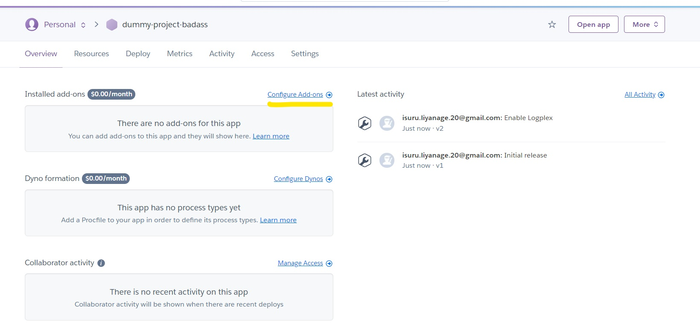

# Deployment using Heroku

We use Heroku to deploy our server. To this end we need to take care of the connection with the database. Since we use the add-on provided by Heroku (ClearDB). This means that will only need to update the file *bdd.go* specifying what is the mysql database credentials.

# Deployment from scratch 

If you want to deploy the server on your own Heroku account, use the following process.

## Prerequesites

- An Heroku account with billing information provided
- The Heroku CLI installed
- Git installed
- MySQL Workbench

## Create the Heroku project 

Login to your Heroku account 

```term
$ heroku login
heroku: Press any key to open up the browser to login or q to exit
 ›   Warning: If browser does not open, visit
 ›   https://cli-auth.heroku.com/auth/browser/***
heroku: Waiting for login...
Logging in... done
Logged in as me@example.com
```

Create a project on Heroku. The command will set up an heroku project with a random name.

```term
$ heroku create
Creating blooming-water-4431... done
http://blooming-water-4431.herokuapp.com/ | git@heroku.com:blooming-water-4431.git
Git remote heroku added
```

## Add a MySQL add-on on Heroku

After the project is created by Heroku, you need to configure the add-on for mysql. 
Go on Overview section of your project and click on Configure Add-ons



Then search for mysql and select *ClearDB MySQL* and click *Submit Order Form*.


Go to to the *Settings* section once it's done and click *Reveal Config Vars* in the *Config Vars* part.
Add a new global variable *ENV* and key *PROD*. You can also check the mysql databases credentials. We will use those to populate the database on Heroku using MySQL Workbench. So do not close the page yet.


## Populate the Heroku database

Launch MySQL workbench and click on the plus button (+). Use the credentials to connect to the DB and click on *Test Connection*


You can now connect to the database remotly. Click on the newly created connection and select *Server > Data Import*


Open the *create_tables.sql* file and modify the first line to use the correct database. Check the credentials or just look at the name of the db on your left panel 

Select *Import from Self-Contained File* and select the *create_tables.sql* file. 


Click on *Start Import* button. You should see this as a sucess.


You can click on the db and refresh it, you should see the tables correctly imported. 


## Update the ConnectToDB function in bdd.go

You need to update the ConnectToDB function in [bdd.go](bdd.go) in order to update the credentials with your Heroku DB. You need to update the *DATABASE_URL* variable with the following the syntax : 

```go
DATABASE_URL='user:pass@tcp(hostname:3306)/your_heroku_database'
```

## Push the server app on Heroku

Run the following command in your heroku CLI and on the project folder. Don't forget to ```heroku login```

```term
$ git init
$ git add .
$ git commit -m "server deployment"
```

Push the files to Heroku.

```term 
git push heroku main
Enumerating objects: 521, done.
Counting objects: 100% (521/521), done.
Delta compression using up to 8 threads
Compressing objects: 100% (309/309), done.
Writing objects: 100% (521/521), 226.26 KiB | 45.25 MiB/s, done.
Total 521 (delta 141), reused 501 (delta 134)
remote: Compressing source files... done.
remote: Building source:
remote:
remote: -----> Go app detected
remote: -----> Fetching jq... done
remote:
remote: -----> Detected go modules - go.mod
remote:
remote: -----> Installing go1.17.2
remote: -----> Fetching go1.17.2.linux-amd64.tar.gz... done
remote:  !!    Installing package '.' (default)
remote:  !!
remote:  !!    To install a different package spec add a comment in the following form to your `go.mod` file:
remote:  !!    // +heroku install ./cmd/...
remote:  !!
remote: -----> Running: go install -v -tags heroku -mod=vendor .
remote: gopkg.in/bluesuncorp/validator.v5
remote: github.com/gin-gonic/gin/render
remote: github.com/manucorporat/sse
remote: github.com/mattn/go-colorable
remote: golang.org/x/net/context
remote: github.com/heroku/x/hmetrics
remote: github.com/heroku/x/hmetrics/onload
remote: github.com/gin-gonic/gin/binding
remote: github.com/gin-gonic/gin
remote: github.com/heroku/go-getting-started
remote:
remote: Compiled the following binaries:
remote:        ./bin/go-getting-started
remote:
remote: -----> Discovering process types
remote:        Procfile declares types -> web
remote:
remote: -----> Compressing...
remote:        Done: 5.5M
remote: -----> Launching...
remote:        Released v3
remote:        https://go-on-heroku.herokuapp.com/ deployed to Heroku
remote:
remote: Verifying deploy... done.
To https://git.heroku.com/go-on-heroku.git
 * [new branch]      main -> main
```

The app is built automatically and you should check the logs on Heroku.

